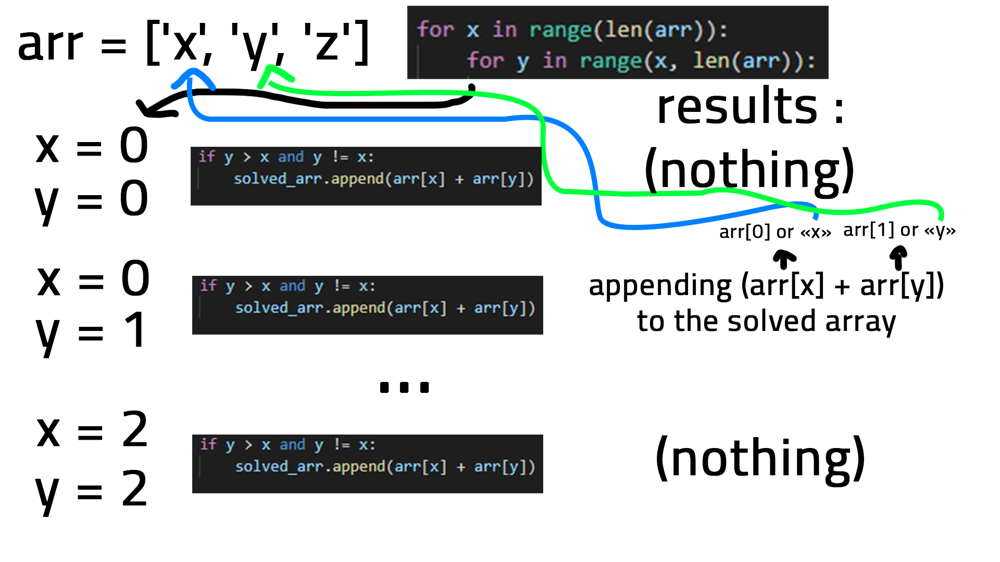

# The Coding Problem :
---
```
Given a string, generate all possible subsequences of the string.

For example, given the string xyz, return an array or set with the following strings:

x
y
z
xy
xz
yz
xyz

Note that zx is not a valid subsequence since it is not in the order of the given string.
```
# Solution #1 :
### Solving Steps :
    1 - Getting the length of the string and displaying it
    2 - Generating an array of chracters from the input string
    3 - Appending each character to the solved array and the temporary array
    4 - Basically just looping through the array multiple times to get the substrings (see the image below)
    5 - Adding all the characters stored in the temporary array to the temporary string and then appendingit to the solved array
    6 - Done
- Note : This solving method can be improved further more so feel free to contribute to this repo and adding your own improved solution.

Step 4 :

